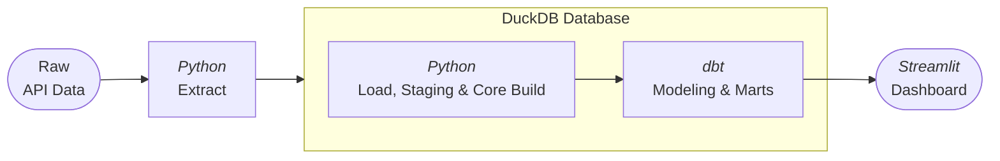
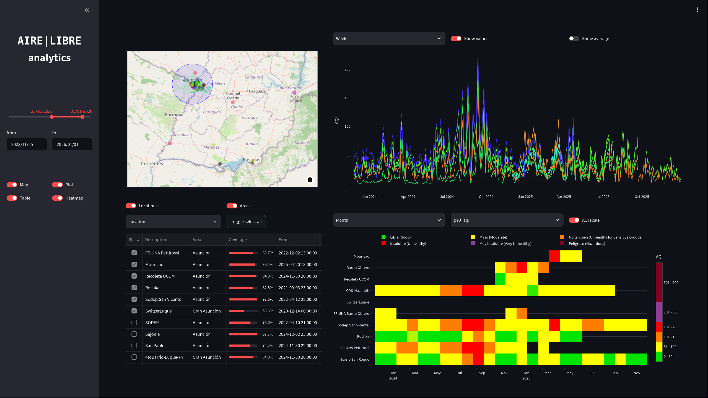
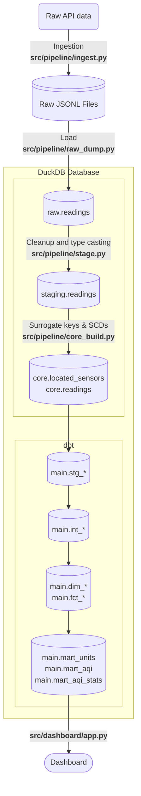

# airelibre-analytics

Data pipeline + dashboard for historical Air Quality Index (AQI) data, from the [AireLibre](https://www.airelib.re) project.





More information on the AireLibre project can be found [here](https://github.com/melizeche/AireLibre).

## Features

- Data pipeline: ELT (Extract, Load, Transform) process utilizing a multi-schema, layered architecture.

- Visualization: Interactive dashboard, serving analytics data from pre-processed (mart) tables.

- Containerization: Easily reproducible, ready to run on a local machine.


## Getting started

To spin up things locally, you only need to have Docker and `make` installed.

1. Clone the repository:
```bash
git clone https://github.com/danderbas/airelibre-analytics
```

2. Then, 
```bash
cd airelibre-analytics
make all
```
This will execute the Docker build, run the data pipeline and serve the dashboard.


3. Finally, view the results:

Once the terminal quiets down, you can point your browser to [http://localhost:8501](http://localhost:8501).


<details>
<summary>Note:</summary> 

some raw data (in the form of JSONL files) is already included (compressed, in the `data` folder). The current configuration is set so that the ingestion script will load some more data from AireLibre's backend [Linka](https://github.com/tchx84/linka), but not too much. You can change these settings in the `config.yaml` file, editing the values for `ingestion/{start,end}_datetime`.
</details>


## Project evolution

It [started simple](./docs/markdown/exploration-start.md), in the terminal, fetching some data with `curl` and exploring it (before writing any python scripts).

From there, the main tools for exploration were jupyter [notebooks](./docs/notebooks) (python, pandas, matplotlib; later polars+duckdb and plotly for the interactive plots).

After iterating ~~a few times~~, it turned into a multi-schema ELT pipeline, with dbt-generated marts at the far end and a dashboard that queries them.

### Exploratory Data Analysis (EDA) Notebooks

- [PM Measurements](https://danderbas.github.io/airelibre-analytics/notebooks/eda_core.html/eda_pm_measurements.html)
- [Raw data exploration](https://danderbas.github.io/airelibre-analytics/notebooks/eda_raw.html)
- [Processed data analysis](https://danderbas.github.io/airelibre-analytics/notebooks/eda_core.html)

## Stack

**Pipeline**


**Dashboard**


## Data pipeline details




- **Ingestion/Extraction** `src/pipeline/ingest.py` Requests the data from the API in consecutive 1-hour intervals. Stores it in raw form, date-partitioned, in JSONL files (`data/raw/%Y-%m-%d.jsonl`). Idempotent: checks what intervals are missing and queries those only.

(From here, each step continues to be idempotent, but the tables are simply overwritten, since this takes only a few seconds)

- **Load** `src/pipeline/raw_dump.py` Moves the raw data into a local (DuckDB) database.  `Schema: raw, Table: readings`

- **Transform**
    - `src/pipeline/stage.py` Data cleanup: deduplicates and filters out bad data, e.g. invalid coordinates. `Schema: staging, Table: readings`
    - `src/pipeline/core_build.py` Given that some sensors might re-locate (a Slowly Changing Dimension Type 2 scenario: entity's attributes change, but past records aren't overwritten), it becomes necessary to identify sources by a combination of their id and location, hence a surrogate id is generated, corresponding to the combination sensor+location. `Schema: core, Tables: located_sensors, readings`

- **Modeling** The rest is left to dbt, for which the standard layering conventions are applied `Schema: main, Tables:`
    - `stg_*` staging models mirroring core tables, with some minor renaming,
    - `int_*` intermediate models with business logic/joins,
    - `dim_*, fct_*` dimensional and fact tables (star schema),
    - `mart_units, mart_aqi, mart_aqi_stats` (final marts).


The dashboard queries the mart tables directly to render the visualizations.

(See `src/config.py` for parameter setting)

## Mart tables

**The tables** include dimensions+facts per unit: id, type, description/location, first/last reading, lifespan and coverage (during its lifespan, what fraction of the time actually has data).

### Units: locations|areas (`mart_units`)

While the main unit of analysis is the `located_sensor` (simply referred to as `location`, in dbt), it seemed interesting to consider grouping different (nearby) sensors and considering their average reading as if it were coming from a single location. Hence, the sensor `unit` can be generalized, taking it to be either a single location or a group of nearby locations (an `area`).

These areas are defined as concentric circles. The first and most-concentrated area is Asunción (capital city of Paraguay), centered at (-25.282108,-57.635053) and including every sensor within 8 km.

The next one is Gran (Big) Asunción, covering a radius of 25 km.

**The trick** is: when taking the average from Gran Asunción, to not count again all the locations within it; instead, we take Asunción as if it were just one location (the average of every sensor in Asunción) and group that with all locations in the shell from km 8 to km 25, then take the average.

The same nesting trick repeats outward.

By applying this rule, we can zoom out and take a country-level average without giving disproportionate weight to wherever the sensors are more clustered in.

Area label | Radius [km]
-|-
Asunción|8
Gran Asunción|25
Macro Asunción|60
Paraguay|$` \infty `$


### AQI (air quality index) and time granularity (`mart_aqi`)

The use of grouping nearby sensors by area is that one can get a smoother value that's representative of what is going on, even if some sensors malfunction.

In a similar way, this also happens when we focus on a sensor: its AQI readings can be noisy, but if we group a few readings together, we get a smoother curve.

**This table** contains, per unit and datetime: the raw aqi values, rolling averages calculated with 1-day, 7-day and 30-day windows and the count of actual values within each window. 


### AQI stats (`mart_aqi_stats`)

In this case, what's computed are not values per hour or datetime, but values per period. Again, this is done per period (start/end date are among the fields) and unit, for periods (or time granularities) of different lengths: day, week and month.

**This table** presents various statistic values that are calculated for the AQI, per date interval and unit, such as:
- max and min
- median and 90th percentile
- average and standard deviation


## Dashboard

There are 4 main components:
- **(Geo) Map:** shows units, either as points (locations) or circles (areas) (fetches `mart_units`)
- **Table:** allows choosing what units' values to display, also showing information about them (fetches `mart_units`)
- **Plots:** displays AQI curves per unit and time, allowing for different time grains, also showing the average of the group shown (fetches `mart_aqi`)
- **Heatmap:** shows AQI stats per unit and period, for different time grains, allowing the user to choose the value to be shown (p90_aqi, median, avg, etc) and the colorscale (fetches `mart_aqi_stats`)

Also, there's a sidebar, to choose the date range for which the data is displayed and to toggle on/off the above mentioned components.

## Acknowledgments

This project wouldn't exist without:

- [**AireLibre**](https://www.airelib.re): the decentralized, community-driven air quality initiative this project is built on top of
- [**Linka**](https://github.com/tchx84/linka): the backend/API that receives sensor measurements and that the pipeline's ingestion step queries directly
- **Red Descentralizada de Aire Libre (ReDAL)**: the volunteers building and maintaining the physical sensor network that actually produces the data

AireLibre is itself an umbrella-project for several independent sub-projects (firmware, mobile apps, a Twitter bot, etc). See the full list [here](https://github.com/melizeche/AireLibre#proyectos-bajo-el-paraguas-de-airelibre).


## License


This project is licensed under the [MIT License](./LICENSE).
